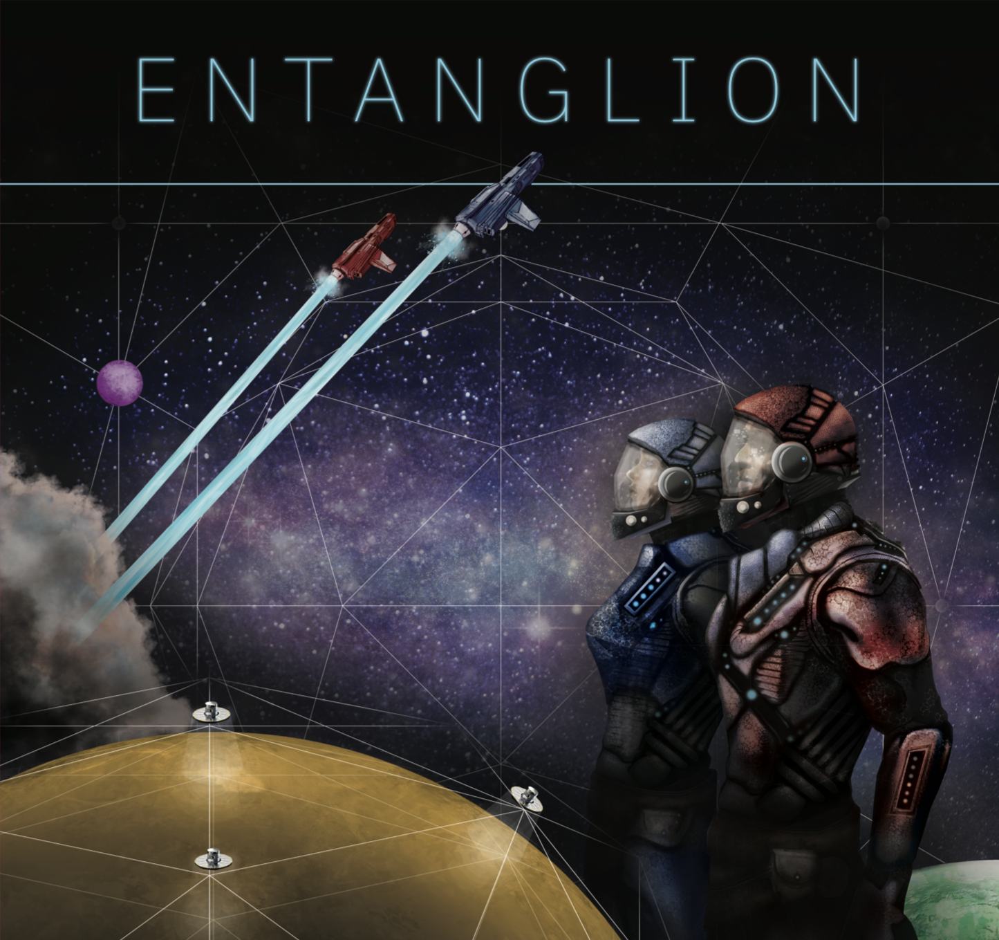
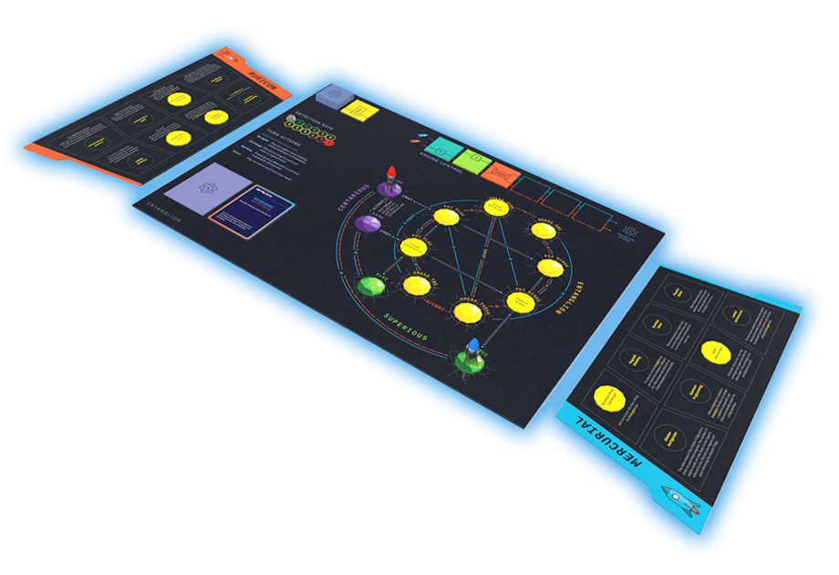

# Entanglion

> A game by IBM Research

**2 PLAYERS | AGES 14 & UP | 45 MINUTES**

[Entanglion](http://ibm.biz/entanglion) awaits your space navigation skills and strategic planning to explore a new galaxy and reconstruct an ancient quantum computer. [Entanglion](http://ibm.biz/entanglion) is a cooperative board game designed for two players. Learn about quantum computing as you work together with your teammate to navigate the three galaxies of the quantum universe, avoid detection by the defense mechanisms left behind by the ancients, and rebuild the quantum computer.

Think you’re up for the challenge?

## Welcome to the quantum universe, Captain!
Congratulations, your captain has retired and left you in charge of his galactic shipping business! Now it's time to make some upgrades.

For years, you've been obsessed with rumors of an ancient quantum computing technology that could revolutionize galactic cargo transport. If the rumors were true, it would allow your ships to calculate hyperspace paths in mere seconds! There's only one problem: the ancients dismantled their quantum computer out of fears that it was too powerful, and they left the components scattered across planets in the heavily-guarded Entanglion galaxy.

If you want to rebuild this incredible technology, you'll have to navigate your ships through the Entanglion galaxy and out-maneuver the defenses the ancients left behind. The good news is that your old captain left you enough money to outfit your ships with the quantum-powered engines you'll need to enter Entanglion. The bad news is that without a quantum computer to guide them, these engines can be a little… unpredictable.

## Making Entanglion
Entanglion is an open source project and you can make your own copy of the game by downloading and printing the assets.

🚀 **[Entanglion Printing & Assembly guide](assets)**

## Playing Entanglion
Please read through the [rule book](game) to understand how to play Entanglion. The online version of the rule book should be considered authoritative, and we will document any errata we find in the printed guide on that page.

## Teaching Entanglion
If you are an educator who would like to use Entanglion as part of a learning curriculum, please [reach out to us](mailto:entanglion@us.ibm.com). We would love to hear about your plans for Entanglion and we may be able to support your efforts.

## Expanding Entanglion
Entanglion is an open-source project developed by IBM Research to teach players about quantum computing. We welcome community contributions to modify and extend gameplay. If you would like to develop an expansion to Entanglion, please check out our [expansion guide](expansions).

# Contributors
Entanglion was designed by IBM Research in New York.

**Design**: [Maryam Ashoori](https://github.com/maryamashoori), [Justin D. Weisz](https://github.com/jweisz) 
**Illustration**: [Aaron Cox](https://twitter.com/aarrccooxx), [Michael L. Kenney](https://www.linkedin.com/in/michaelleekenney/) 
**Science**: [Jay M. Gambetta](https://github.com/jaygambetta), [Jerry M. Chow](https://github.com/jerrymchow), and [Lev S. Bishop](https://github.com/levbishop) 

# License
 This work is licensed under a <a rel="license" href="http://creativecommons.org/licenses/by-nc-sa/4.0/">Creative Commons Attribution-NonCommercial-ShareAlike 4.0 International License</a>.
